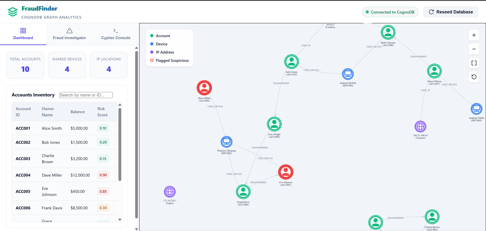
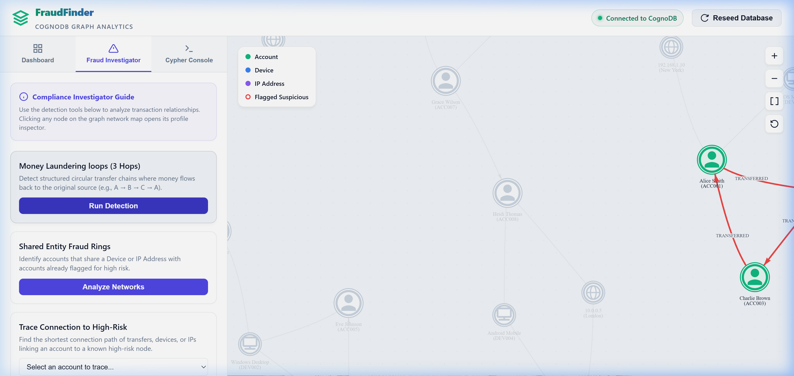
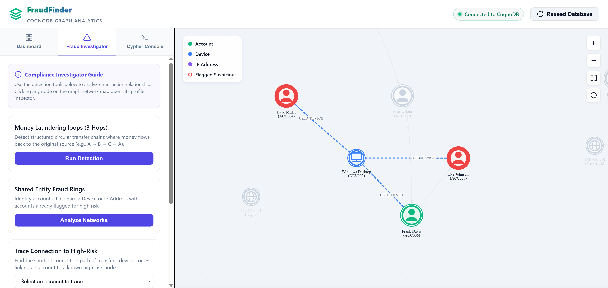
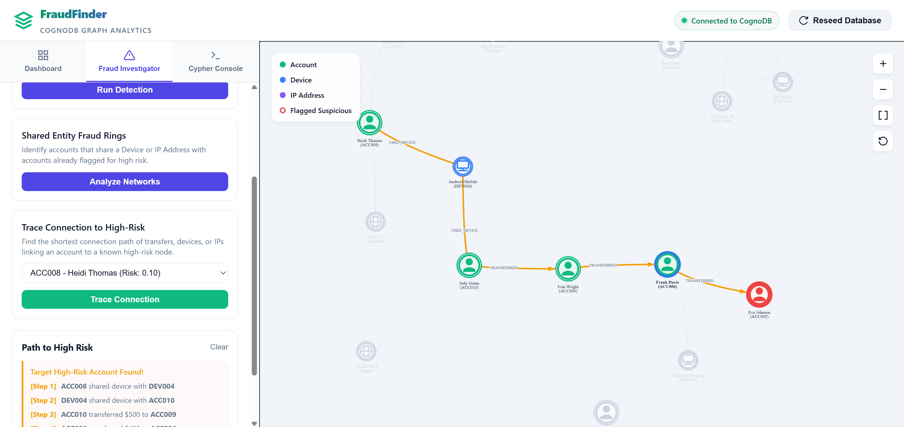
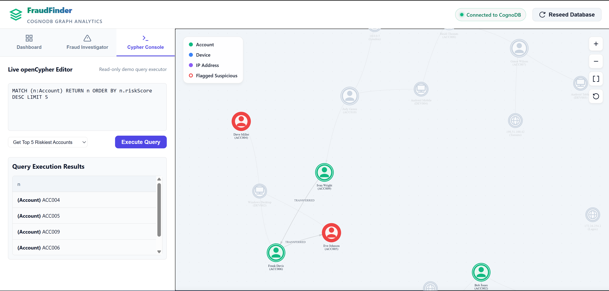

# FraudFinder: CognoDB Graph Database Application

### 🔗 Deployed Live Demo: [https://fraudfinder-0h3r.onrender.com/](https://fraudfinder-0h3r.onrender.com/)
### 🎥 Video Demo Walkthrough: [Click Here to Watch Video (Loom/Drive Link)]()

FraudFinder is a real-time compliance and transaction monitoring dashboard built for identifying money laundering loops and shared identity fraud rings. 

This application is built as a candidate assessment for **Wexa AI**, using **CognoDB Cloud** (speaking openCypher over Bolt) as the database layer and an interactive Node.js/Express and Vis.js web stack.



---

## 1. Why a Graph Database? (Relational vs. Graph)

Traditional relational databases (SQL) represent transactions as rows in a massive table. While this is excellent for writing new transactions quickly, it is structurally deficient for analyzing the relationships *between* those transactions.

### Key Advantages of CognoDB (Graph) over SQL:
1. **Index-Free Adjacency:** In SQL, to find out if Account A is connected to Account B through a chain of transfers (e.g., $A \rightarrow B \rightarrow C \rightarrow A$), the database must perform multiple self-joins on a table with millions of rows. As the path length grows, query execution times degrade exponentially. In CognoDB, relationships are stored as direct memory pointers. Traversing a relationship is an $O(1)$ operation, making multi-hop queries run in milliseconds regardless of overall database size.
2. **Built-in Pathfinding:** Finding the shortest connection path between a regular user and a known fraudster (to detect indirect risk) requires complex recursive queries (CTEs) or graph-algorithm plugins in SQL. In Cypher, it is a native, highly optimized single line of code: `shortestPath(...)`.
3. **Flexible Schema (No Migrations):** Financial crime patterns evolve. If we need to start tracking new entities like Phone Numbers, Device Fingerprints, or Social Media Profiles, a relational database requires database schema migrations and downtime. In CognoDB, we can write new node labels and relationship types dynamically without affecting existing data.

---

## 2. Graph Data Model

The database represents a mock banking network consisting of account transfers, device logins, and location IPs.

### Schema Diagram (Mermaid)

```mermaid
classDiagram
    class Account {
        accountId: String (e.g. ACC001)
        ownerName: String
        email: String
        balance: Float
        riskScore: Float
        createdAt: String
    }
    class Device {
        deviceId: String (e.g. DEV001)
        deviceType: String (Mobile/Desktop)
        os: String (iOS/Windows/Android)
    }
    class IPAddress {
        ipAddress: String (e.g. 192.168.1.10)
        location: String
    }

    Account --> Account : TRANSFERRED {amount: Float, timestamp: String, transactionId: String}
    Account --> Device : USED_DEVICE {lastUsed: String}
    Account --> IPAddress : USED_IP {lastUsed: String}
```

---

## 3. Core Cypher Queries (Interview Cheat Sheet)

Below are the exact queries used in the application. Be prepared to explain these in your interview.

### Query 1: Circular Transfer Detection (Money Laundering)
Detects structured transfer chains of length 3 where money is sent through intermediate accounts and returns to the source to disguise origins.

```cypher
MATCH (a1:Account)-[r1:TRANSFERRED]->(a2:Account)-[r2:TRANSFERRED]->(a3:Account)-[r3:TRANSFERRED]->(a1)
WHERE a1.accountId < a2.accountId AND a2.accountId <> a3.accountId AND a1.accountId <> a3.accountId
RETURN a1, a2, a3, r1, r2, r3
```
* **Explanation:**
  * `MATCH` finds a path pattern where node `a1` has a `TRANSFERRED` relationship to `a2`, which transfers to `a3`, which transfers back to `a1`.
  * `WHERE a1.accountId < a2.accountId` is a crucial optimization. It ensures that the cycle is only returned once, preventing duplicates of the same loop in different orders (e.g., A&rarr;B&rarr;C and B&rarr;C&rarr;A).
  * `a2.accountId <> a3.accountId AND a1.accountId <> a3.accountId` ensures all three accounts in the loop are distinct.
* **Why it's awkward in SQL:** Requires joining a `transactions` table to itself three times. If you want to detect loops of arbitrary length (e.g., up to 6 hops), the query becomes unmaintainable and crashes under heavy transaction loads.



---

### Query 2: Shared Entity Fraud Rings (Guilt by Association)
Identifies "mule" or secondary accounts that log in from the same devices or IP addresses as known high-risk accounts.

```cypher
MATCH (riskAcc:Account)-[r1:USED_DEVICE|USED_IP]->(sharedEnt)<-[r2:USED_DEVICE|USED_IP]-(suspectAcc:Account)
WHERE riskAcc.riskScore >= 0.8 AND riskAcc <> suspectAcc
RETURN riskAcc, sharedEnt, suspectAcc, r1, r2
```
* **Explanation:**
  * `MATCH` uses a multi-relationship syntax `[:USED_DEVICE|USED_IP]` to find paths that connect a flagged high-risk account (`riskScore >= 0.8`) to any other account through a shared `Device` or `IPAddress` node.
  * `riskAcc <> suspectAcc` ensures we don't match the risk account to itself.
* **Why it's awkward in SQL:** Requires joining `accounts`, `device_logins`, and `ip_logins` tables. Finding shared connections requires multiple join conditions and group-by clauses, which degrades query performance.



---

### Query 3: Shortest Path to High-Risk Entities (Indirect Risk Analysis)
Calculates the shortest path of transfers, shared devices, or shared IPs between a user-selected account and any known high-risk account.

```cypher
MATCH path = shortestPath(
  (startAcc:Account {accountId: $accountId})-[:TRANSFERRED|USED_DEVICE|USED_IP*..5]-(riskAcc:Account)
)
WHERE riskAcc.riskScore >= 0.8 AND startAcc <> riskAcc
RETURN path
```
* **Explanation:**
  * `shortestPath(...)` is a built-in Cypher function that runs a Breadth-First Search (BFS) to find the minimum number of connections between two nodes.
  * `[:TRANSFERRED|USED_DEVICE|USED_IP*..5]` tells the graph to traverse any of these relationship types, up to a maximum depth of 5 hops.
  * `$accountId` is a parameterized variable passed securely by the Node.js driver.
* **Why it's awkward in SQL:** Standard SQL cannot perform shortest-path queries natively. It requires writing a complex recursive CTE with cycle detection, which is hard to write, test, and optimize.



---

## 4. Technology Stack & Project Structure

- **Backend:** Node.js (Express server)
- **Database Driver:** `neo4j-driver` (Official Neo4j package, fully compatible with CognoDB Cloud over Bolt)
- **Frontend:** React, modular JSX components (Header, DashboardTab, FraudTab, ConsoleTab, GraphCanvas, Inspector)
- **Bundler:** Vite
- **Graph Visualization:** `Vis.js Network` (imported locally via npm)



```
wexa-ai/
├── frontend/               # React + Vite Frontend Project
│   ├── src/                # React Source Code
│   │   ├── components/     # UI Components (Header, Tabs, Viewports, drawers)
│   │   ├── App.jsx         # App Controller & API Hooks
│   │   └── index.css       # Client-side Styling (Slate-Light Theme variables)
│   ├── vite.config.js      # Dev Server Proxy Configuration
│   └── package.json        # Frontend scripts and npm dependencies
├── server.js               # Express API and CognoDB Driver Lifecycle
├── seed.js                 # Seeding script containing transaction seed data
├── package.json            # Scripts & dependencies (dotenv, express, neo4j-driver)
├── .gitignore              # Ignores node_modules, build outputs, and .env
├── .env.example            # Environment variables template
└── README.md               # This documentation
```

---

## 5. Setup and Running Locally

### Step 1: Install Root Dependencies
Navigate to your root workspace directory and install Express backend packages:
```powershell
npm install
```

### Step 2: Configure Environment Variables
Create a file named `.env` in the root directory (based on `.env.example`):
```env
PORT=3000
COGNODB_URI=bolt+s://<instance-id>.databases.cognodb.com
COGNODB_USERNAME=cognodb
COGNODB_PASSWORD=your_generated_password
```

### Step 3: Seed the Database
Populate your database with the mock transaction network containing pre-engineered fraud loops:
```powershell
npm run seed
```

### Step 4: Install and Build Frontend React Assets
Navigate to the `frontend/` folder, install dependencies, and build the React project:
```powershell
cd frontend
npm install
npm run build
cd ..
```
*Note: Vite compiles the React app into `frontend/dist`. The Express backend is configured to automatically serve files from `frontend/dist` if they exist.*

### Step 5: Start the Server
Launch the Express application in the root folder:
```powershell
npm start
```
Open your browser and navigate to `http://localhost:3000` to view the running React dashboard!

### Step 6: Optional Hot-Reloading Development Mode
If you are actively editing React component files:
1. Run `npm start` in the root folder to launch the Express API server on `http://localhost:3000`.
2. Open another terminal in the `frontend/` directory and run:
   ```powershell
   npm run dev
   ```
3. Open `http://localhost:5173`. Any API calls to `/api/...` are automatically proxied to the backend running on port 3000.

---

## 6. Hosting instructions (For Submission)

The assessment requires a hosted demo link. We recommend using **Render** (free tier):

1. Commit your codebase to a **GitHub repository**. Make sure your `.env` file is **not** committed (check that it is ignored in `.gitignore`).
2. Log in to [Render](https://render.com) and click **New > Web Service**.
3. Link your GitHub repository.
4. Set the following settings:
   - **Environment:** `Node`
   - **Build Command:** `npm install && cd frontend && npm install && npm run build`
   - **Start Command:** `npm start`
5. Click **Advanced** and add your environment variables:
   - `COGNODB_URI`: `bolt+s://...`
   - `COGNODB_USERNAME`: `cognodb`
   - `COGNODB_PASSWORD`: `your_password`
6. Click **Deploy Web Service**. Render will provision your app and provide a live URL.

---

## 7. Graceful Error Handling & Unreachable States
If CognoDB becomes unreachable or is offline, the backend does **not** crash. The server starts normally and serves the static React files. 
- The `/api/db-status` endpoint returns a disconnected state.
- The frontend renders a red status LED in the header showing "CognoDB Unreachable" and alerts the user to check their database connection.
- Any attempts to query the database return a service error containing a clean message, ensuring a smooth, non-crashing user experience.an error message, ensuring a smooth, non-crashing user experience.
